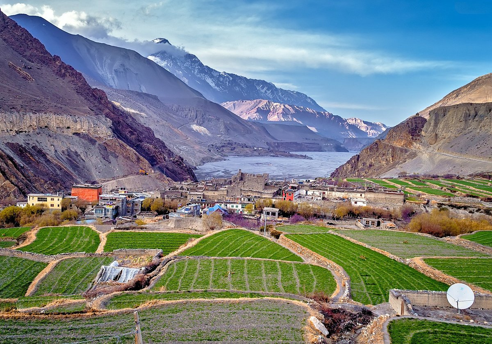

<div align="center">



# Mustang Kyidug USA

**Official website of Mustang Kyidug USA** — a New York–based nonprofit founded in 2003,
dedicated to preserving the culture, language and traditions of the Mustangi community
in the United States and supporting development back home in Mustang, Nepal.

🌐 **Live site: [mustangkyidug.com](https://mustangkyidug.com)**


</div>

## ✨ Highlights

- **Design system inspired by Mustang itself** — monastery clay red, ochre gold,
  Himalayan sky blue, and the five prayer-flag colours as a signature strip
- **Animations** — Ken Burns hero, staggered headline reveal, scroll-reveal sections,
  animated counters, auto-scrolling photo filmstrip; all respect `prefers-reduced-motion`
- **Responsive** — sticky glass header, full-screen mobile menu, fluid type with
  `clamp()`, grids that collapse gracefully (verified from 375 px phones to wide desktop)
- **Gallery** — masonry photo grid with keyboard-navigable lightbox (arrows / Escape)
  and privacy-friendly `youtube-nocookie` film embeds
- **Accessibility & SEO** — semantic landmarks, alt text, visible focus rings,
  `aria-current` nav marking, unique titles and meta descriptions per page

## 📄 Pages

| File | Page |
|---|---|
| `index.html` | Home — full-screen hero, mission, pillars, festivals preview, photo filmstrip |
| `about.html` | About — story, mission & vision, what we do |
| `origin.html` | History — Kingdom of Lo, animated timeline, migration story |
| `people.html` | Community — Loba & Thakali peoples, programs in the USA |
| `culture.html` | Culture — Buddhism, language, thangka, dress, cuisine |
| `events.html` | Events — Losar, Tiji, Chhongu, Dhazang, ways to get involved |
| `tourism.html` | Tourism — Lo Manthang, Muktinath, Kagbeni, treks, travel tips |
| `gallery.html` | Gallery — 27-photo lightbox gallery + 6 community films |
| `contact.html` | Contact — info cards, form, embedded map |

## 🧱 Tech

A zero-dependency static site: semantic HTML5, modern CSS (custom properties, grid,
fluid sizing) and vanilla JavaScript. No build step, no frameworks — clone and open.

## 🚀 Run locally

```bash
# any static server works, e.g.
python -m http.server 8000
# then open http://localhost:8000
```

…or simply open `index.html` in a browser.

## 📁 Structure

```
├── index.html … contact.html   # 9 pages
├── css/style.css               # single design-system stylesheet
├── js/main.js                  # nav, reveals, counters, lightbox, form
├── images/                     # community photography
└── favicon.svg
```

## 🔧 Maintainer notes

- The contact form opens the visitor's mail app pre-addressed to
  `mustangkyidug@gmail.com`; for in-page submission, point the form at a
  [Formspree](https://formspree.io) endpoint in `js/main.js`.
- Fonts (Fraunces + Manrope) load from Google Fonts.
- To add gallery photos: drop files into `images/` and add a matching
  `<a data-lightbox>` block in `gallery.html`.

---

<div align="center">

© Mustang Kyidug USA · Photography courtesy of the Mustang Kyidug community

</div>
